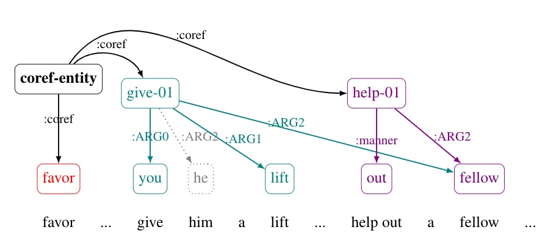

# Setup

make an environment with python 3.7

activate environment
```
pip install -r requirements.txt
```

# Create docAMR representation

Link to NAACL 2022 paper https://aclanthology.org/2022.naacl-main.256.pdf



To create docAMR representation from gold AMR3.0 data and the coref annotation in xml format:
```
python doc_amr.py 
--amr3-path <path to AMR3 data> 
--coref-fof <file-with-list-of-xml-annotations-files> 
--out-amr <output file> 
--rep <representation>
```
```<path to AMR3 data>``` should point to uncompressed LDC data directory for LDC2020T02 with its original directory structure.

```<file-with-list-of-xml-annotations-files>``` is one of the ```_coref.fof``` files included in this repository.

Default value for ```--rep``` is ```'docAMR'```. Other values can be: ```'no-merge'```,```'merge-names'```,```'merge-all'```. Use ```--help``` to read the descriptions of these representations.

-------

To create docAMR representation from dcoument AMRs with no nodes merged
```
python doc_amr.py
       --in-doc-amr-unmerged <path to document-level AMRs un no-merge format>
       --rep <representation>
       --out-amr <output file>
```

-------

To create docAMR representation from dcoument AMRs with pairwise edges between a representative node in the chain and the rest of the nodes in the chain:
```
python doc_amr.py
       --in-doc-amr-pairwise <path to document-level AMR with pairwise coref edges>
       --pairwise-coref-rel <relation label indicating coref edges>
       --rep <representation>
       --out-amr <output file>
```

default value for ```--pairwise-coref-rel``` is ```same-as```

# Evaluate docAMR (docSmatch) 

Use docSmatch the same way as the standard Smatch. 

```
python docSmatch/smatch.py -f <amr1> <amr2>
```

It assumes that ```:snt``` relations connect sentences to the root. Moreover, it assumes that the numeric suffix of ```:snt``` is the sentence number and that the matching sentence numbers in the two AMRs are aligned.

You can also get a detailed score breakdown for the accuracy of coreference prediction:
```
python docSmatch/smatch.py -f <amr1> <amr2> --coref-subscore
```
This will ouput the normal smatch score as 'Overall Score', as well as a 'Coref Score' indicating the quality of cross sentential edges and nodes.
